# 🎬 Autopilot — Automated Reel Publisher

> Schedule, review, and auto-publish your video content to Instagram Reels and YouTube Shorts — all from Telegram or a web dashboard.


---

## What It Does

Autopilot connects your Google Drive to Instagram and YouTube. Drop videos into a Drive folder — the system handles the rest.

```
Google Drive  →  Telegram Review  →  Approve  →  Auto Upload  →  Instagram Reels + YouTube Shorts
```

**3x per day** (10 AM · 3 PM · 8 PM), the bot messages you with a video to review. You approve it from your phone or desktop dashboard. The next cycle uploads it automatically.

---

## Features

- 📂 **Google Drive sync** — reads videos directly from your Drive folder
- 🤖 **Telegram bot** — sends video previews with Approve / Shuffle / Skip buttons
- 📸 **Instagram Reels** — auto re-encodes and publishes via Graph API
- ▶️ **YouTube Shorts** — uploads with resumable chunked transfer
- ⏰ **Scheduler** — runs 3x daily, fully automated
- 🗃️ **State tracking** — every video tagged `pending → approved → uploaded / skipped`
- 📊 **Streamlit dashboard** — web UI for review, history, and manual controls
- 🚫 **No duplicate uploads** — SQLite database prevents re-posting

---

## Demo Flow

```
Bot sends video preview on Telegram
        ↓
You tap ✅ Approve
        ↓
Bot asks: "Add caption & hashtags"
        ↓
You choose: 📸 Instagram  /  ▶️ YouTube  /  🚀 Both
        ↓
Next cycle: video downloads, re-encodes, uploads, DB updates
        ↓
"🚀 Reel published! Post ID: 18099571255807500"
```

---
## 🏗️ Architecture




## Tech Stack

| Layer | Tool |
|---|---|
| Language | Python 3.11+ |
| Drive source | Google Drive API v3 |
| Bot | python-telegram-bot v21 |
| Instagram | Instagram Graph API v19 |
| YouTube | YouTube Data API v3 |
| Video hosting | Cloudinary (free tier) |
| Video encoding | ffmpeg |
| Scheduler | APScheduler 3.x |
| Dashboard | Streamlit |
| Database | SQLite |

---

## Project Structure

```
autopilot/
├── main.py                  # Entry point
├── .env                     # Your secrets (never commit)
├── requirements.txt
├── config/
│   └── settings.py          # Loads .env variables
├── database/
│   └── db.py                # SQLite — state tracking
├── services/
│   ├── drive_service.py     # Google Drive integration
│   ├── telegram_service.py  # Telegram bot + conversation flow
│   ├── instagram_service.py # Instagram Reels upload
│   ├── youtube_service.py   # YouTube Shorts upload
│   └── uploader.py          # Upload orchestrator
├── scheduler/
│   └── job.py               # APScheduler cron jobs
└── dashboard/
    └── app.py               # Streamlit web dashboard
```

---

## Prerequisites

- Python 3.11+
- [ffmpeg](https://ffmpeg.org/download.html) installed and on PATH
- A Google account with Drive
- A Telegram account
- An Instagram **Business or Creator** account connected to a Facebook Page
- A YouTube channel
- Free accounts on [Cloudinary](https://cloudinary.com) and [Google Cloud](https://console.cloud.google.com)

---

## Installation

**1. Clone the repo**
```bash
git clone https://github.com/chandraPrakash-tripathi/AUTOPILOT.git
cd AUTOPILOT
```

**2. Create and activate a virtual environment**
```bash
python -m venv venv
venv\Scripts\activate      # Windows
source venv/bin/activate   # Mac / Linux
```

**3. Install dependencies**
```bash
pip install -r requirements.txt
```

**4. Install ffmpeg**

Windows: download from [gyan.dev](https://www.gyan.dev/ffmpeg/builds/), extract, add `bin/` to your system PATH.  
Mac: `brew install ffmpeg`  
Linux: `sudo apt install ffmpeg`

---

## API Setup

### 1 · Google Drive API

1. Go to [Google Cloud Console](https://console.cloud.google.com) → Create project
2. Enable **Google Drive API**
3. Create a **Service Account** → download the JSON key → rename it `service_account.json` → place in project root
4. Copy the `client_email` from the JSON
5. Share your Drive reels folder with that email (Viewer access)
6. Copy your folder ID from the Drive URL:
   ```
   https://drive.google.com/drive/folders/THIS_IS_YOUR_FOLDER_ID
   ```

### 2 · Telegram Bot

1. Open Telegram → search **@BotFather** → `/newbot`
2. Follow the prompts → copy your bot token
3. Search **@userinfobot** → `/start` → copy your numeric Chat ID

### 3 · Instagram Graph API

1. Go to [Facebook Developers](https://developers.facebook.com/apps) → Create App → Business
2. Add **Instagram Graph API** product
3. Make sure your Instagram is switched to **Creator or Business** account
4. Use [Graph API Explorer](https://developers.facebook.com/tools/explorer) to generate a token with:
   - `instagram_basic`
   - `instagram_content_publish`
   - `pages_read_engagement`
5. Exchange for a **long-lived token** (valid 60 days):
   ```
   GET https://graph.facebook.com/v19.0/oauth/access_token
     ?grant_type=fb_exchange_token
     &client_id=APP_ID
     &client_secret=APP_SECRET
     &fb_exchange_token=SHORT_TOKEN
   ```
6. Get your Instagram Account ID:
   ```
   GET https://graph.facebook.com/v19.0/me/accounts?access_token=TOKEN
   GET https://graph.facebook.com/v19.0/PAGE_ID?fields=instagram_business_account&access_token=TOKEN
   ```

### 4 · YouTube Data API v3

1. In the same Google Cloud project → Enable **YouTube Data API v3**
2. Create **OAuth 2.0 Client ID** → Desktop app → download JSON → rename `client_secrets.json`
3. Configure OAuth consent screen → External → add scope `youtube.upload` → add your Google email as test user
4. On first run, a browser window opens for login — after that it's silent

### 5 · Cloudinary

1. Sign up free at [cloudinary.com](https://cloudinary.com)
2. From your dashboard copy: Cloud Name, API Key, API Secret

> **Why Cloudinary?** Instagram's API requires a public URL to download videos from. Google Drive URLs are private. Cloudinary provides a trusted CDN URL that Instagram can always access.

---

## Configuration

Create a `.env` file in the project root:

```env
# Google Drive
GOOGLE_DRIVE_FOLDER_ID=your_folder_id_here

# Telegram
TELEGRAM_BOT_TOKEN=your_bot_token_here
TELEGRAM_CHAT_ID=your_chat_id_here

# Instagram
INSTAGRAM_ACCOUNT_ID=your_ig_account_id
INSTAGRAM_ACCESS_TOKEN=your_long_lived_token

# YouTube
YOUTUBE_CLIENT_SECRETS_FILE=client_secrets.json

# Cloudinary
CLOUDINARY_CLOUD_NAME=your_cloud_name
CLOUDINARY_API_KEY=your_api_key
CLOUDINARY_API_SECRET=your_api_secret

# Schedule (24hr, comma-separated)
SCHEDULE_TIMES=10:00,15:00,20:00
```

---

## Running

**Initialize the database (first time only)**
```bash
python -m database.db
```

**Start the full system**
```bash
python main.py
```

**Start the dashboard (separate terminal)**
```bash
streamlit run dashboard/app.py
# Opens at http://localhost:8501
```

---

## Usage

Once `main.py` is running:

1. Send `/start` to your Telegram bot to trigger a review session
2. The bot shows a video preview with **✅ Approve · 🔀 Shuffle · ⏭️ Skip** buttons
3. Approve → type your caption → choose Instagram / YouTube / Both
4. The scheduler automatically uploads approved videos at your set times

**Bot commands**

| Command | Action |
|---|---|
| `/start` | Sync Drive and review next video |
| `/status` | Show counts by status |
| `/cancel` | Exit current flow |
| `/default` | Use a default caption |

**Manual commands**

```bash
# Manually upload all approved videos right now
python -m services.uploader

# Manually sync Drive for new videos
python -m services.drive_service

# Test Instagram connection
python -m services.instagram_service

# Test YouTube connection
python -m services.youtube_service
```

---

## How the Upload Pipeline Works

```
Approved video in DB
        ↓
Download from Google Drive
        ↓
Re-encode with ffmpeg
(H.264 + LC-AAC + yuv420p + faststart)
        ↓
Upload to Cloudinary → get public URL
        ↓
POST URL to Instagram API → container_id
        ↓
Poll until FINISHED (~15–30s)
        ↓
Publish Reel → post_id saved to DB
        ↓
Delete from Cloudinary · delete local file
        ↓
DB status = 'uploaded' ✅
```

---

## Important Notes

- **Instagram token expires every 60 days.** Refresh it:
  ```
  GET https://graph.facebook.com/v19.0/oauth/access_token
    ?grant_type=ig_refresh_token
    &access_token=YOUR_CURRENT_TOKEN
  ```
  Paste the new token into `.env`.

- **Videos must be 3–90 seconds** for Instagram Reels. Videos outside this range will fail.

- **Free Cloudinary tier** gives 25 GB storage + 25 GB bandwidth/month. Videos are deleted from Cloudinary immediately after Instagram processes them, so storage usage stays near zero.

- **YouTube Shorts** are auto-detected by YouTube when the video is under 60 seconds and `#Shorts` is in the description.

---

## .gitignore

Make sure these files are never committed:

```
.env
service_account.json
client_secrets.json
youtube_token.json
*.db
downloads/
__pycache__/
*.pyc
venv/
```

---

## Contributing

Pull requests are welcome. For major changes, open an issue first to discuss what you'd like to change.

---

## License

[MIT](LICENSE)

---

<p align="center">Built with Python · Powered by caffeine ☕</p>